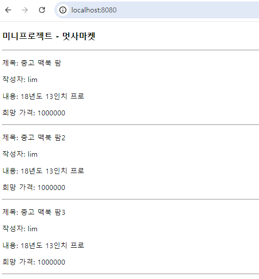

# **백엔드 스쿨 5기 미니 개인프로젝트 - ♻️멋사마켓♻️**

```
사람들이 많이 사용하고 있는 🥕당근마켓, 중고나라 등의 중고 제품 거래 플랫폼을 만들어보는 미니 프로젝트입니다.

사용자가 중고 물품을 자유롭게 올리고, 댓글을 통해 소통하며, 최종적으로 구매 제안에 대하여
수락할 수 있는 형태의 중고 거래 플랫폼의 백엔드를 만들어봅시다.
```

<br>

## History

### 2023-06-29
> **Create**: git repsitory - 'MiniProject_Basic_LimHyoungTaek'<br>
> ```markdown
> # dependencies
>   - Spring Web
>   - Spring Boot DevTools
>   - Spring Data JPA
>   - Lombok
>   - Thymeleaf
>   - Sqlite
> ```
>
> **Add**:
> ```markdown
> - ERD(SalesItem, Negotiation, Comment)
> - Controllers, repositories, entities, services associated with SalesItem
> - item.html
> ```

<br>

### 1. ~~~ 기능 구현
> 
> <br> 어쩌구 저쩌구 내용을 씁시다.
