# **백엔드 스쿨 5기 미니 개인프로젝트 - ♻️멋사마켓♻️**


> 요즘 사람들이 많이 사용하고 있는 🥕당근마켓, 중고나라 등의 중고 제품 거래 플랫폼을 만들어보는 미니 프로젝트입니다.<br>사용자가 중고 물품을 자유롭게 올리고, 댓글을 통해 소통하며, 최종적으로 구매 제안에 대하여 수락할 수 있는 형태의 중고 거래 플랫폼입니다.

<br><br>
## ⚙ 기술 스택
<p>


</p>
<p>


</p>


<br><br>

## 📅 Market ERD
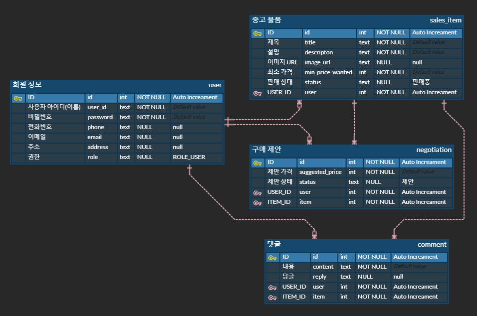

<br><br>

## 📁 REST API
<details>
<summary><b>💡 ① 중고 물품 관리, 댓글, 제안</b></summary>

`git clone` 이후, `application.properties`의 `jwt.secret` 값을 변경해야 작동합니다.

### 1. 물품 관리
<details>
<summary><b><u>중고 물품 관리 API</u></b></summary>

**✅ 표시: 로그인 시 JWT 발급 → Auth(Type=Bearer Token): JWT 입력**

<details><summary> 1. POST /items ✅</summary>

Request Body:
```json
{
    "title": "중고 맥북 팝니다",
    "description": "2019년 맥북 프로 13인치 모델입니다",
    "minPriceWanted": 1000000
}
```

Response Body:

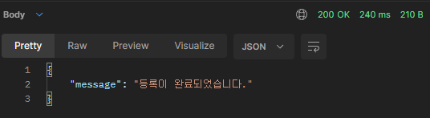

</details>

<details><summary> 2. GET /items?page={page}&limit={limit} </summary>

Response Body:

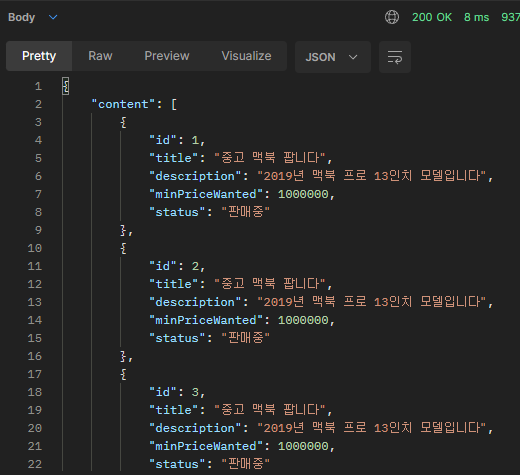

</details>

<details><summary> 3. GET /items/{itemId} </summary>

Response Body:

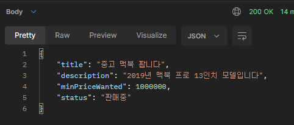

</details>


<details><summary> 4. PUT /items/{itemId} ✅</summary>

Request Body:
```json
{
    "title": "응 안팔아",
    "description": "걍 내가 쓸꺼야",
    "minPriceWanted": 5000000
}
```

Response Body:

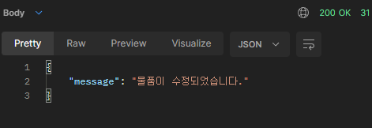

</details>


<details><summary> 5. PUT /items/{itemId}/image ✅</summary>

Request Body & Response Body:

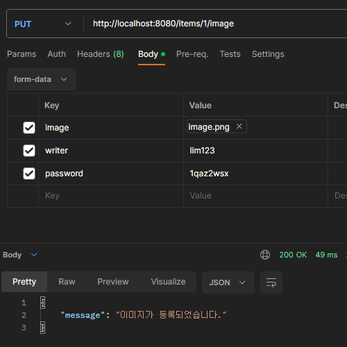

</details>
<details><summary> 6. DELETE /items/{itemId} ✅</summary>

Response Body:

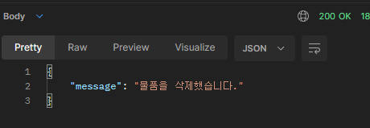

</details>
<br>

[📁 **REST API 돌아가기**](#-rest-api)

</details>

### 2. 물품 댓글
<details>
<summary><b><u>중고 물품 댓글 API</u></b></summary>

**✅ 표시: 로그인 시 JWT 발급 → Auth(Type=Bearer Token): JWT 입력**

<details><summary> 1. POST /items/{itemId}/comments ✅</summary>

Request Body:
```json
{
    "content": "할인 가능하신가요?"
}
```

Response Body:

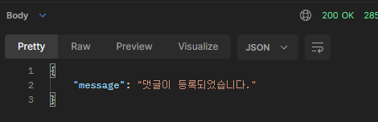

</details>
<details><summary> 2. GET /items/{itemId}/comments?page=1 </summary>

Request Body:<br>
page 값을 파라미터로 10개 단위로 보여준다.

Response Body:

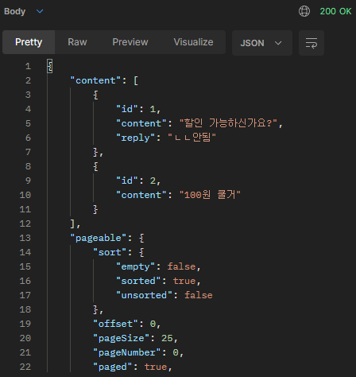

</details>
<details><summary> 3. PUT /items/{itemId}/comments/{commentId} ✅</summary>

Request Body:
```json
{
    "content": "1000000 정도면 고려 가능합니다"
}
```

Response Body:

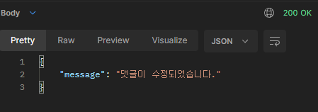

</details>
<details><summary> 4. PUT /items/{itemId}/comments/{commentId}/reply ✅</summary>

Request Body:
```json
{
    "reply": "ㄴㄴ안됨"
}
```

Response Body:


</details>
<details><summary> 5. DELETE /items/{itemId}/comments/{commentId} ✅</summary>

Response Body:

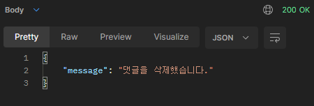

</details>

<details><summary> 6. 답글은 물품 등록 작성자를 제외하고는 달 수 없다. ✅</summary>

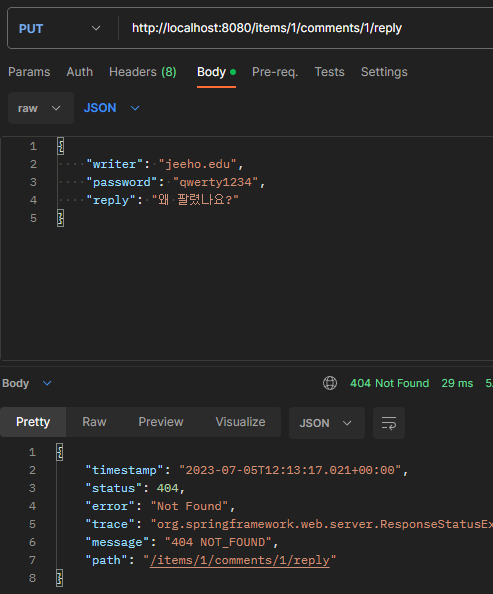

</details>

<details><summary> 7. ROLE_ADMIN 권한이 있는 사용자는 물품 등록 작성자가 아니어도 댓글을 달 수 있다. ✅</summary>

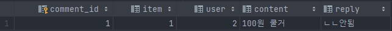

</details>

<br>

[📁 **REST API 돌아가기**](#-rest-api)

</details>

### 3. 구매 제안
<details>
<summary><b><u>구매 제안 API</u></b></summary>

**✅ 표시: 로그인 시 JWT 발급 → Auth(Type=Bearer Token): JWT 입력**

<details><summary> 1. POST /items/{itemId}/proposals ✅</summary>

Request Body:
```json
{
    // 구매 제안을 올린 구매자
    "suggestedPrice": 1000000
}
```

Response Body:


</details>
<details><summary> 2. GET http://localhost:8080/items/1/proposal?page=1 ✅</summary>

Response Body:

**1) 중고 물품을 올린 판매자가 확인할 수 있는 page**

<br><br>

**2) 구매 제안을 올린 구매자가 확인할 수 있는 page**
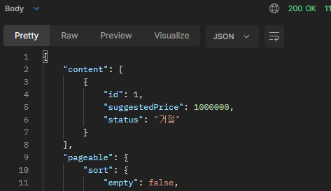

</details>
<details><summary> 3. PUT /items/{itemId}/proposals/{proposalId} ✅</summary>

Request Body:
```json
{
    // 구매 제안을 올린 구매자
    "suggestedPrice": 7777777
}
```

Response Body:

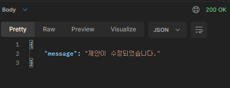

</details>
<details><summary> 4. DELETE /items/{itemId}/proposals/{proposalId} ✅</summary>

Response Body:

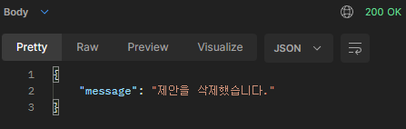

</details>
<details><summary> 5. PUT /items/{itemId}/proposals/{proposalId} ✅</summary>

Request Body:
```json
{
    // 중고 물품을 올린 판매자
    "status": "거절" // "수락"도 가능
}
```

Response Body:

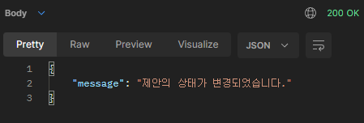

</details>
<details><summary> 6. PUT /items/{itemId}/proposals/{proposalId} ✅</summary>

Request Body:
```json
{
    // 구매 제안을 올린 구매자
    "status": "확정"
}
```

Response Body:

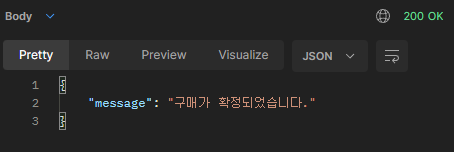

</details>

<details><summary> 7. 그 외 </summary>

**PUT /items/{itemId}/proposals/{proposalId}**

- 3번의 PUT(제안 가격 변경)의 경우 구매 제안 작성자만 수정이 가능하며, `status`가 "제안", `SuggestedPrice`가 null이 아닐 때만 작동한다.
- 5번의 PUT(수락, 거절)의 경우 물품 등록 작성자만 수정 가능하며, 상태가 수락, 거절이 되었을 경우 구매 제안 작성자는 글을 수정할 수 없다.
- 6번의 PUT(구매 확정)의 경우 구매 제안 작성자만 수정이 가능하며, 현재 "수락" 상태이고 Request로 받는 `status`가 "확정"이면 `status`는 "확정"으로 변한다.

    물품 등록 게시물 또한 "판매 완료"가 된다. 이 상태에서 게시물, 구매 제안을 지울 수 없다. 
    
    또한 자동으로 모든 구매제안은 "거절" 상태가 된다.
- `ROLE_ADMIN`의 권한을 가지고 있다면 구매 제안 API의 모든 기능을 사용할 수 있으며, "판매 완료" 상태가 되어도 수정이나 삭제가 가능하다.

</details>
<br>

[📁 **REST API 돌아가기**](#-rest-api)

</details>

<br>

</details>

<details>
<summary><b>💡 ② 사용자 인증, 관계 설정, 접근 권한 설정</b></summary>

### 1. 사용자 인증
<details>
<summary><b><u>로그인(토큰 발급), 회원가입 API</u></b></summary><br>

<details><summary> 1. POST /users/login </summary>

Request Body:
```json
{
  // ROLE_ADMIN 권한을 가진 TEST 계정 존재
  "userId": "운영자",
  "password": "asdf"
}
```

Response Body:

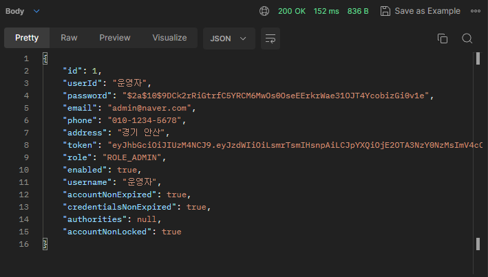

</details>

<details><summary> 2. GET /users/login </summary>

Request Body:

**(JSON Data)**
```json
{
  // 회원가입
  "userId": "유저",
  "password": "asdf"
}
```
**(Form Data)**
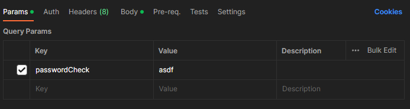

Response Body:

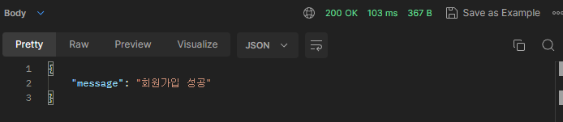

DB:

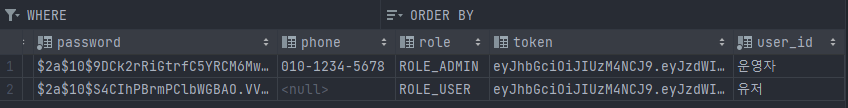

<br>

[📁 **REST API 돌아가기**](#-rest-api)

</details>

</details>

### 2. 관계 설정
<details>
<summary><b><u>ERD 수정 및 코드 수정 API</u></b></summary>

**1. 기존 Entity(Item, Comment, Proposal)의 writer, password 삭제 -> User Enitiy와 1:N 매핑**<br>
[📅 **Market ERD 참고**](#-market-erd)<br>

**2. ERD 변경에 의한 제대로 된 기능 작동을 위한 코드 수정**<br>[📁 **REST API - 💡 ① 중고 물품 관리, 댓글, 제안 참고**](#-rest-api)<br>

**3. 자세한 수정 사항**<br>
**ISSUE :** [2️⃣ DAY 2 / 관계 설정하기](https://github.com/likelion-backend-5th/Project_1_LimHyoungTaek/issues/6) 참고<br>
**PULL REQUEST :** [관계 설정 및 관계 변경으로 인한 코드 변경 #8](https://github.com/likelion-backend-5th/Project_1_LimHyoungTaek/pull/8) 참고

<br>

</details>


### 3. 접근 권한 설정
<details>
<summary><b><u>ROLE STATUS 추가</u></b></summary>

**1. Authentication 추가로 인한 등록(삭제, 변경 등), 조회를 사용자 정보에 따라 제한되거나 가능하게 변경**
 - `ROLE_ADMIN`, `ROLE_USER` 두 권한이 존재하며, `ROLE_ADMIN`은 [**💡 ① 중고 물품 관리, 댓글, 제안**](#-rest-api)의 모든 기능 사용 가능
 - `확정` 상태의 구매 제안을 삭제하는 등 제한되어 있는 기능도 사용할 수 있다.

**2. 자세한 수정 사항**<br>
**ISSUE :** [3️⃣ DAY 3/ 기능 접근 설정하기](https://github.com/likelion-backend-5th/Project_1_LimHyoungTaek/issues/7) 참고<br>
<br><br>
[📁 **REST API 돌아가기**](#-rest-api)

</details>


<br>

</details>

<details>
<summary><b>💡 ③ UI 구현</b></summary>

[//]: # (<summary><b>💡 ③ 채팅, UI 구현, 인증 서버 분리</b></summary>)

### 1. INDEX, 로그인, 회원가입
<details>
<summary><b>HOME - GET / -> (redirect)/items/view</b></summary>

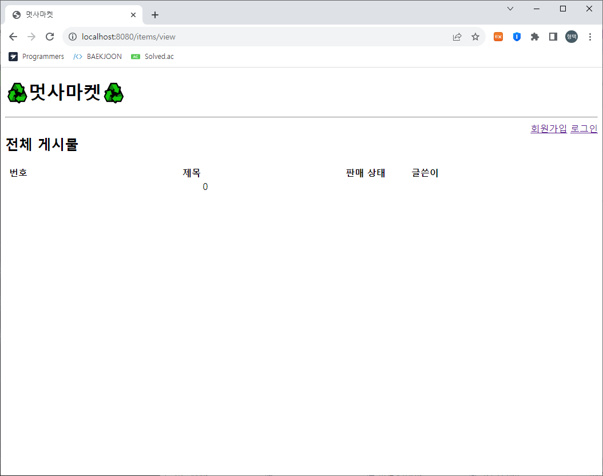

</details>

<details>
<summary><b>회원가입 - GET /users/register/view</b></summary>

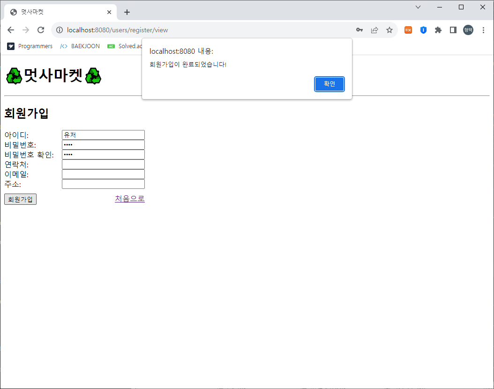

</details>

<details>
<summary><b>로그인 - GET /users/login/view</b></summary>

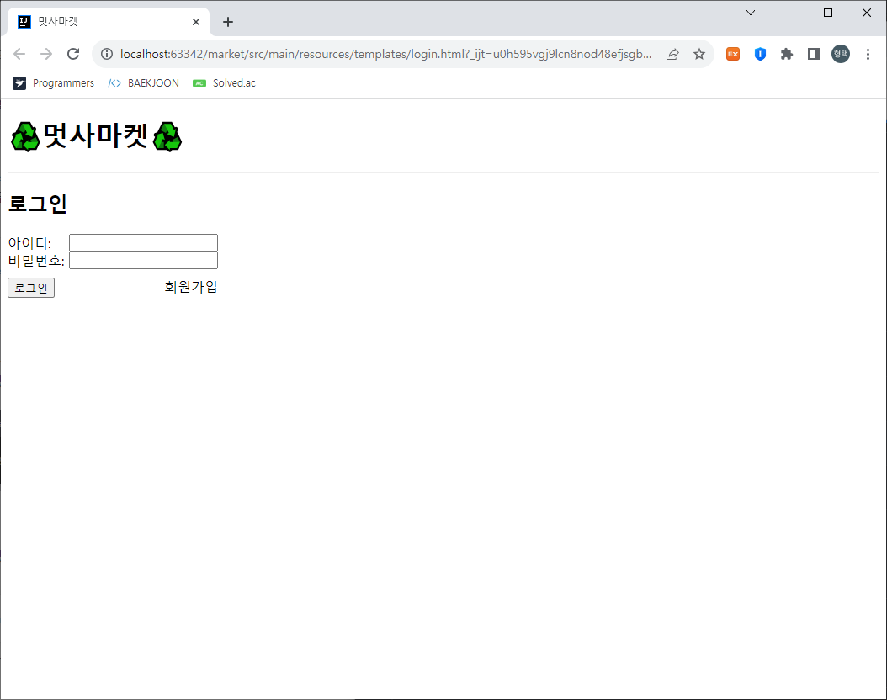

</details>

<details>
<summary><b>로그인 후 HOME - GET /items/view</b></summary>


<br>

[📁 **REST API 돌아가기**](#-rest-api)
</details>


### 2. 물품 등록, 이미지 업로드, 물품 화면
<details>
<summary><b>물품 등록 - GET /items/register/view</b></summary>

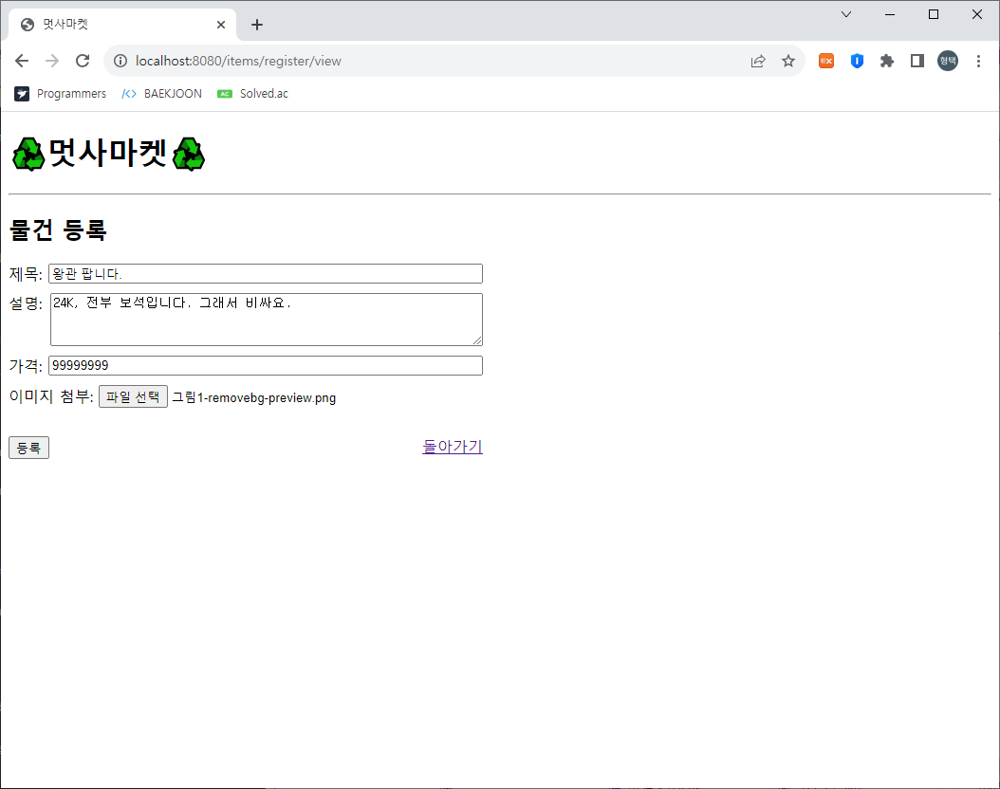
</details>

<details>
<summary><b>전체 게시물 - GET /items/view</b></summary>

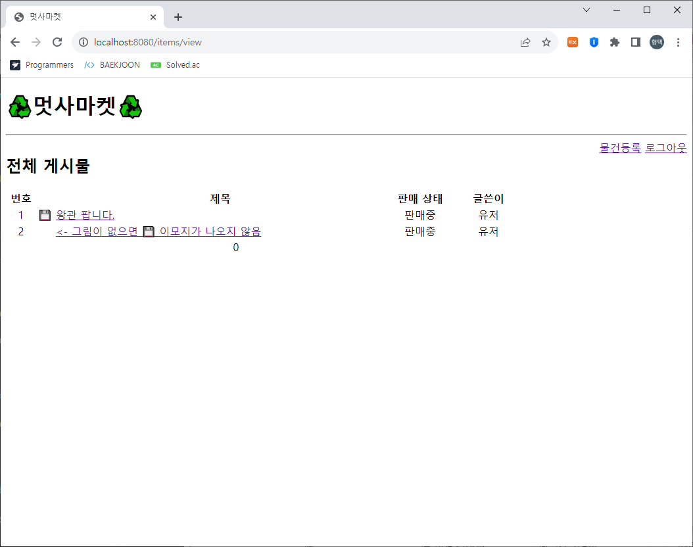
</details>

<details>
<summary><b>물품 보기 - GET /items/view/{itemId}</b></summary>

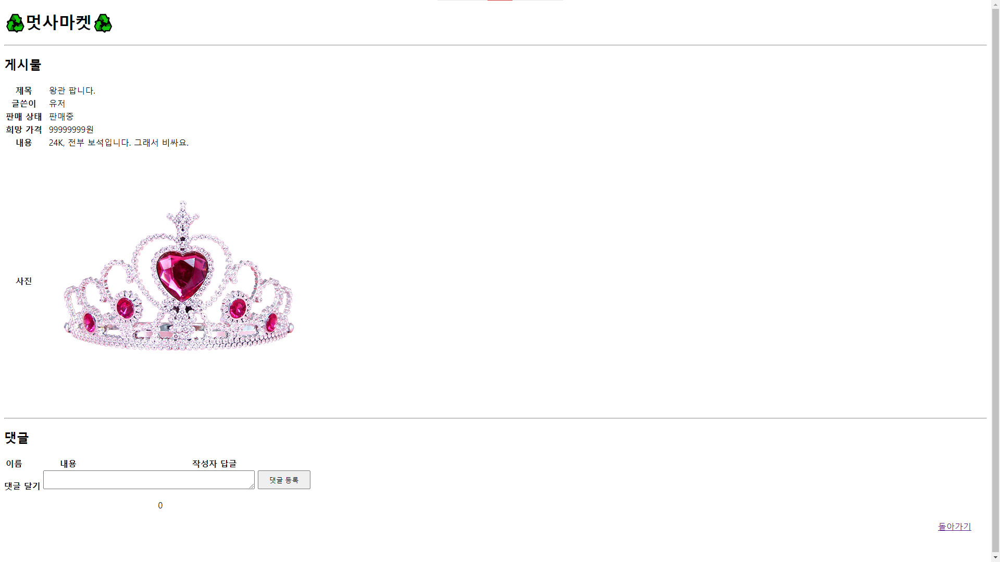

</details>

<details>
<summary><b>댓글 - GET /items/view/{itemId}</b></summary>

댓글 다는 것은 html 상에서 구현되지 않았습니다.

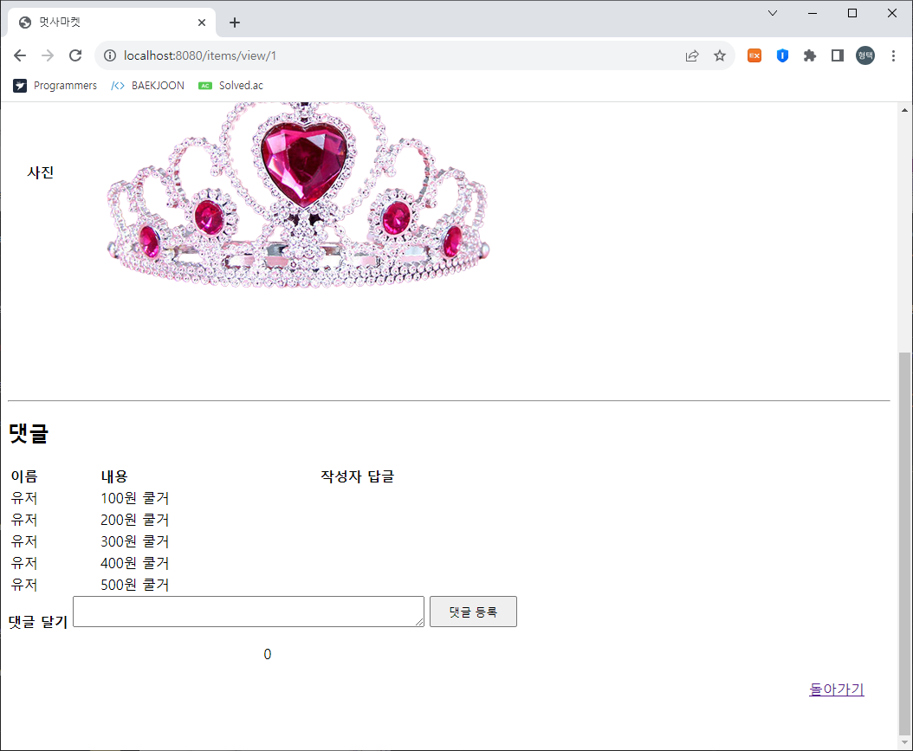

<br>

[📁 **REST API 돌아가기**](#-rest-api)
</details>

### 3. Page
<details>
<summary><b>HOME(Page 관련) - GET / -> (redirect)/items/view</b></summary>

글이 10개 이상 넘어가면 게시물 페이지를 넘길 수 있다.
댓글도 가능하며 댓글은 15개가 limit으로 잡혀 있다.

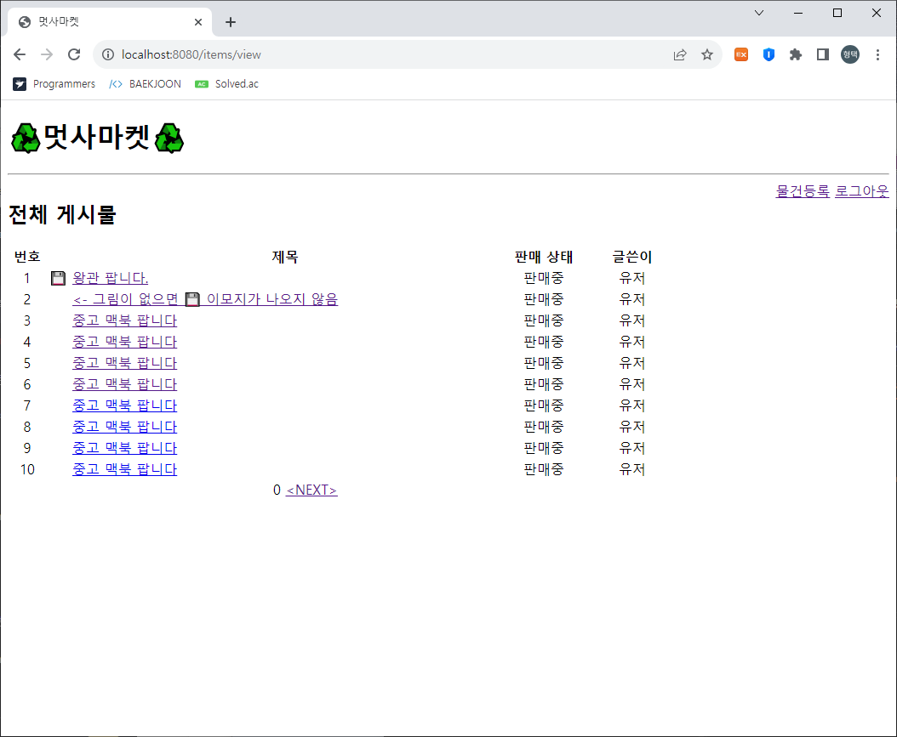
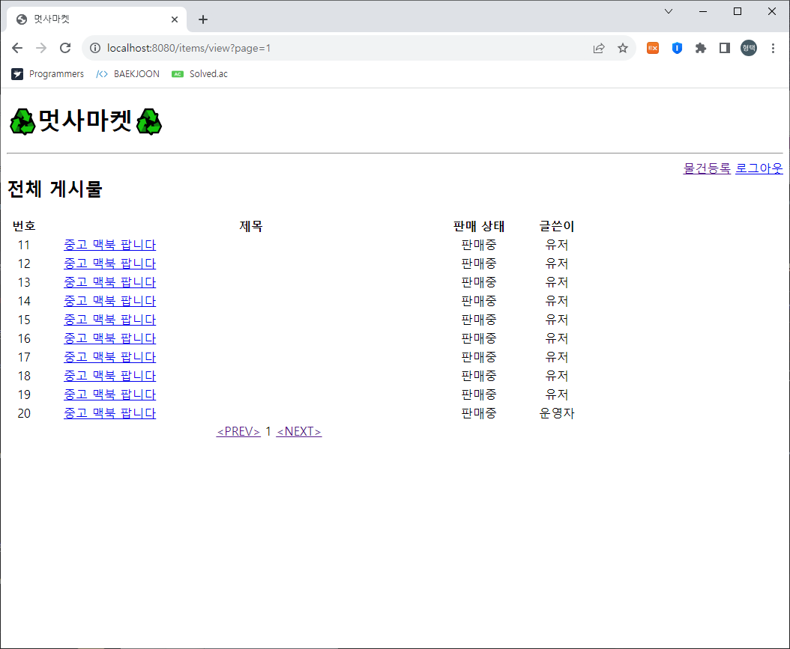

<br>

[📁 **REST API 돌아가기**](#-rest-api)
</details>

</details>

<br><br>

## 📜 History 

### 📆 2023.06.29 ~ 2023.07.05
<details>
<summary>펼쳐 보기</summary>

<details>
<summary>✨ <b>2023-06-29</b>: Repository 생성, DTO 추가, SalesItem MVC 구조</summary>

---
### 2023-06-29
**Create**: Git Repository - 'MiniProject_Basic_LimHyoungTaek'<br>

> ### dependencies
>   - Spring Web
>   - Spring Boot DevTools
>   - Spring Data JPA
>   - Lombok
>   - Sqlite

**Add**:
> - DTO(SalesItem, Negotiation, Comment)
> - Controller, repository, entity, service associated (with SalesItem)
---
</details>


<details>
<summary>✨ <b>2023-06-30</b>: ResponseDTO 추가, TODO 구현</summary>

---
### 2023-06-30
**Add**:
> - DTO(ResponseDto)

<br>

**TODO**:
> POST /items<br>
> GET /items?page={page}&limit={limit}<br>
> GET /items/{itemId}<br>
> PUT /items/{itemId}<br>
> DELETE /items/{itemId}<br>
---
</details>


<details>
<summary>✨ <b>2023-07-01</b>: TODO [ PUT /items/{itemId}/image ] 구현</summary>

---
### 2023-07-01
**TODO**:
> PUT /items/{itemId}/image
---
</details>


<details>
<summary>✨ <b>2023-07-03</b>: DAY 1 / 중고 물품 관리 요구사항, 중고 물품 댓글 MVC 구조</summary>

---
### 2023-07-03

<details>
<summary><u><b>DAY 1 / 중고 물품 관리 요구사항</b></u></summary>

**1️⃣ <u>[POST] /items</u>**<br>
`ItemController.create()`, `ItemService.createItem()`<br>: 누구든지 중고 거래를 목적으로 물품에 대한 정보를 등록할 수 있다.<br>

`ItemEntity - @NotNull`<br>: 이때 반드시 포함되어야 하는 내용은 **제목, 설명, 최소 가격, 작성자**이다.<br>

`ItemService.validPW()`<br>: 또한 사용자가 물품을 등록할 때, 비밀번호 항목을 추가해서 등록한다.<br>

`ItemService.createItem()`<br>: 최초로 물품이 등록될 때, 중고 물품의 상태는 **판매중** 상태가 된다.<br>

<br><br>

**2️⃣ <u>[GET] /items?page={page}&limit={limit}</u>**<br>
`ItemService.readItemsPaged()`, `Return Type Page<ItemPageInfoDto>`<br>: 등록된 물품 정보는 누구든지 열람할 수 있다.<br> 페이지 단위 조회가 가능하다.<br>

`ItemController.readAll()`, `ItemController.readOne()`<br>: 전체 조회, 단일 조회 모두 가능하다.<br>

<br><br>

**3️⃣ <u>[GET] /items/{itemId}</u>**<br>
`ItemController.readOne()`<br>: 전체 조회, 단일 조회 모두 가능하다.<br>

<br><br>

**4️⃣ <u>[PUT] /items/{itemId}</u>**<br>
`ItemController.update()`, `ItemService.updateItem()`<br>: 등록된 물품 정보는 수정이 가능하다.
<br>

`ItemService.validPW()`<br>: 이때, 물품이 등록될 때 추가한 비밀번호를 첨부해야 한다.

<br><br>

**5️⃣ <u>[DELETE] /items/{itemId}</u>**<br>
`ItemController.delete()`, `ItemService.deleteItem()`<br>: 등록된 물품 정보는 삭제가 가능하다.<br>

`ItemService.validPW()`<br>: 이때, 물품이 등록될 때 추가한 비밀번호를 첨부해야 한다.

<br><br>

**6️⃣ <u>[PUT] /items/{itemId}/image</u>**<br>
`ItemController.uploadImage()`, `ItemService.uploadItemImage()`<br>: 등록된 물품 정보에 이미지를 첨부할 수 있다.<br>

`ItemService.validPW()`<br>: 이때, 물품이 등록될 때 추가한 비밀번호를 첨부해야 한다.

<br><br>

**7️⃣ <u>그 외 추가 및 수정사항</u>**<br>
`getItemById()`<br>: 해당하는 ID가 없을 경우, Not Found 예외 처리하는 과정을 메서드로 분리<br>

`validPW()`<br>: Password를 검사하는 부분을 메서드로 분리<br>

`ResponseDto`<br>: Controller의 Return Type을 ResponseDto로 수정 후 ResponseBody 출력 형식 message로 변경<br>

`ContentinfoDto`<br>: `ItemController.readOne()`에서 title, description, minPriceWanted, status만 보이게 Dto 설정<br>

`PageinfoDto`<br>: `ItemController.readAll()`에서 id, title, description, minPriceWanted, status만 보이게 Dto 설정<br>
imageUrl -> add @JsonInclude(JsonInclude.Include.NON_NULL) Null 값 일때 미출력<br>

<br>
</details>


<details>
<summary><u><b>중고 물품 댓글 MVC 구조</b></u></summary>

**Add**:
> - CommentController
> - CommentEntity
> - CommentRepository
> - CommentService

<br>

**TODO**:
> POST /items/{itemId}/comments<br>
> GET /items/{itemId}/comments<br>
> PUT /items/{itemId}/comments/{commentId}<br>
> PUT /items/{itemId}/comments/{commentId}/reply<br>
> DELETE /items/{itemId}/comments/{commentId}<br>

</details>

---
</details>


<details>
<summary>✨ <b>2023-07-04</b>: DAY 2 / 중고 물품 댓글 요구사항</summary>

---
### 2023-07-04
**1️⃣ <u>[POST] /items/{itemId}/comments</u>**<br>
`CommentController.createComment()`, `CommentService.postComment()`<br>: 등록된 물품에 대한 질문을 위하여 댓글을 등록할 수 있다.<br>

`CommentEntity - @NotNull`<br>: 이때 반드시 포함되어야 하는 내용은 대상 물품, 댓글 내용, 작성자이다.<br>

`PasswordValidatable.validatePassword()`, `CommentEntity - @Override`<br>: 또한 댓글을 등록할 때, 비밀번호 항목을 추가해서 등록한다.<br>

<br><br>

**2️⃣ <u>[GET] /items/{itemId}/comments</u>**<br>
`CommentController.readAllComment()`, `CommentService.getCommentsPaged()`<br>: 등록된 댓글은 누구든지 열람할 수 있다.<br>

`CommentService.getCommentsPaged()`, `Return Type Page<CommentPageInfoDto>`<br>: 페이지 단위 조회가 가능하다.<br>

<br><br>

**3️⃣ <u>[PUT] /items/{itemId}/comments/{commentId}</u>**<br>
`CommentController.updateComment()`, `CommentService.modifiedComment()`<br>: 등록된 댓글은 수정이 가능하다.<br>

`PasswordValidatable.validatePassword()`, `CommentEntity - @Override`<br>: 이때, 댓글이 등록될 때 추가한 비밀번호를 첨부해야 한다.<br>

<br><br>

**4️⃣ <u>[DELETE] /items/{itemId}/comments/{commentId}</u>**<br>
`CommentController.delete()`, `CommentService.deleteComment()`<br>: 등록된 댓글은 삭제가 가능하다.<br>
`PasswordValidatable.validatePassword()`, `CommentEntity - @Override`<br>: 이때, 댓글이 등록될 때 추가한 비밀번호를 첨부해야 한다.<br>

<br><br>

**5️⃣ <u>[PUT] /items/{itemId}/comments/{commentId}/reply</u>**<br>
`CommentPageInfoDto`<br>: 댓글에는 초기에 비워져 있는 **답글** 항목이 존재한다.<br> ↳ 그래서 다른 Column과 다르게 `@NotNull`을 붙이지 않았다. 대신 `imageUrl`의 `null` 값을 숨길 때 처럼 `@JsonInclude(JsonInclude.Include.NON_NULL)`을 붙였다.<br>

`CommentPageInfoDto`<br>: 답글은 댓글에 포함된 공개 정보이다.<br> ↳ 이 요구사항 때문에 위에서 언급한 `@JsonInclude(JsonInclude.Include.NON_NULL)`도 추가하지 않을까 하다가 `null` 값일 경우, 답글이 보이지 않는 경우가 더 많다고 생각해서 유지하였다.<br>

`CommentService.modifiedReply()`<br>: 만약 댓글이 등록된 대상 물품을 등록한 사람일 경우, 물품을 등록할 때 사용한 비밀번호를 첨부할 경우 답글 항목을 수정할 수 있다.<br>
↳ 이 부분은 아래 토글을 열어 코드를 참고해주세요.

<details>
<summary>📄 <u>CommentService.java - modifiedReply()</u></summary>

```java
public class CommentService {
    private final ItemRepository itemRepository;
    private final ItemService itemService;
    private final CommentRepository commentRepository;

    // Post, Modifying Reply
    public void modifiedReply(Long commentId, Long itemId, CommentDto comments) {
        CommentEntity commentEntity = validateCommentByItemId(commentId, itemId);
        ItemEntity itemEntity = itemService.getItemById(itemId);

        // 1. 답글 작성자 != 물품 등록 작성자 -> 예외 처리
        // 댓글에 답글을 달 수 있는 사용자는 물품 정보를 등록한 사용자 뿐
        if (!itemEntity.getWriter().equals(comments.getWriter()))
            throw new ResponseStatusException(HttpStatus.BAD_REQUEST);

        // 2. 물품 등록 작성자 == 답글 작성자 라는건 위의 예외에서 증명
        // 만약 댓글이 등록된 대상 물품을 등록한 사람일 경우
        // -> 물품 등록 == 댓글 == 답글 다 같은 작성자이다.
        if (commentEntity.getWriter().equals(comments.getWriter())) {
            // 물품을 등록할 때 사용한 비밀번호를 첨부할 경우 답글 항목을 수정할 수 있다.
            // 물품 등록 비밀번호 != 답글 비밀번호 -> 예외 처리
            itemEntity.validatePassword(comments.getPassword());
        }
        // Save Reply
        commentEntity.setReply(comments.getReply());
        CommentDto.fromEntity(commentRepository.save(commentEntity));
    }
}
```
</details>

<br><br>

**6️⃣ <u>그 외 추가 및 수정사항</u>**<br>
`PageinfoDto`<br>: `ItemPageInfoDto`, `CommentPageInfoDto`로 구분을 위해 자세하게 이름 설정<br> `dto/mapping`으로 경로 설정

`PasswordValidatable`<br>: `validPW`를 `ItemEntity`와 `CommentEntity`에서 받을 수 있게 `interface`로 변경<br> 각 `Entity`에서 `implements PasswordValidatable`하고 난 후, `@Override`할 수 있게 변경

`CommentService - validateCommentByItemId()`<br>: 각 메서드마다 요청 댓글 유무, 대상 댓글이 대상 게시글의 댓글인지 확인하는 과정이 겹쳐서 따로 분리<br>

---
<br>
</details>


<details>
<summary>✨ <b>2023-07-04</b>: DAY 3 / 구매 제안 기본 CRUD 구조 생성</summary>

---
### 2023-07-04

**구매 제안 기본 CRUD 구조 생성**

**Add**:
> - ProposalController
> - ProposalEntity
> - ProposalRepository
> - ProposalService
> - ProposalPageInfoDto

<br>

**TODO**:
> POST /items/{itemId}/proposal<br>
> GET /items/{itemId}/proposals?writer=Lim123&password=qwerty1234&page=1<br>
> PUT /items/{itemId}/proposals/{proposalId}<br>
> DELETE /items/{itemId}/proposals/{proposalId}<br>
> PUT /items/{itemId}/proposals/{proposalId}<br>

---
<br>
</details>


<details>
<summary>✨ <b>2023-07-05</b>: DAY 3 / 구매 제안 요구사항</summary>

---
### 2023-07-05

**중고 물품 댓글 MVC 구조**

**1️⃣ <u>[POST] /items/{itemId}/proposals</u>**<br>
`ProposalController.createProposal()`, `ProposalService.postOffer()`<br>: 등록된 물품에 대하여 구매 제안을 등록할 수 있다.<br>

`NegotiationDto - @NotNull`<br>: 이때 반드시 포함되어야 하는 내용은 대상 물품, 제안 가격, 작성자이다.<br> 참고로 이전에 Entity에 붙어있던 `@NotNull`은 다 Dto로 이동함.<br>

`PasswordValidatable.validatePassword()`, `ProposalEntity - @Override`<br>: 또한 구매 제안을 등록할 때, 비밀번호 항목을 추가해서 등록한다.<br>

`ProposalService.postOffer() - newProposal.setStatus("제안");`<br>: 구매 제안이 등록될 때, 제안의 상태는 제안 상태가 된다.<br>

<br><br>

**2️⃣ <u>[GET] /items/{itemId}/proposal?writer=lim123&password=1qaz2wsx&page=1</u>**<br>
`ProposalController.readAllProposal()`<br>: 구매 제안은 대상 물품의 주인과 등록한 사용자만 조회할 수 있다.<br>

`ProposalService.findPagedOffer()`, `ProposalRepository.findAll()`<br>: 대상 물품의 주인은, 대상 물품을 등록할 때 사용한 작성자와 비밀번호를 첨부해야 한다.<br>이때 물품에 등록된 모든 구매 제안이 확인 가능하다.<br>

`ProposalService.findPagedOffer()`, `ProposalRepository.findAllByItemIdAndWriter()`<br>: 등록한 사용자는, 조회를 위해서 자신이 사용한 작성자와 비밀번호를 첨부해야 한다. <br>이때 자신이 등록한 구매 제안만 확인이 가능하다.<br>

`ProposalService.findPagedOffer()`<br>: 페이지 기능을 지원한다.<br>

<br><br>

**3️⃣ <u>[PUT] /items/{itemId}/proposals/{proposalId}</u>**<br>

**1. 구매 제안 작성자의 가격 수정**<br>
`ProposalController.updateProposal()`, `ProposalService.putUpdateOffer()`<br>: 등록된 제안은 수정이 가능하다.<br>

`PasswordValidatable.validatePassword()`, `ProposalEntity - @Override`<br>: 이때, 제안이 등록될때 추가한 작성자와 비밀번호를 첨부해야 한다.<br>

<br><br>

**2. 물품 등록자의 구매 제안 수락, 거절 상태 변경**<br>
`ProposalService.{putUpdateOffer(), acceptRejectOffer()}`<br>: 대상 물품의 주인은 구매 제안을 수락할 수 있다. <br>또한, 대상 물품의 주인은 구매 제안을 거절할 수 있다. 각각 구매 제안의 상태는 수락/거절이 된다.<br>

`PasswordValidatable.validatePassword()`, `ProposalEntity - @Override`<br>: 이때, 제안이 등록될때 추가한 작성자와 비밀번호를 첨부해야 한다.<br>

<br><br>

**3. 구매 제안 작성자의 구매 확정 상태 변경**<br>
`ProposalService.putUpdateOffer()` - `2) 현재 "수락" 상태 & Request "확정" 상태 -> 판매 완료` 부분<br>
<br>1) 구매 제안을 등록한 사용자는, 자신이 등록한 제안이 수락 상태일 경우, 구매 확정을 할 수 있다.<br>
<br>2) 이때 구매 제안의 상태는 확정 상태가 된다.<br>
<br>3) 구매 제안이 확정될 경우, 대상 물품의 상태는 판매 완료가 된다.<br>참고로 확정, 판매 완료 상태의 구매 제안과 게시물은 작성자일지라도 삭제하지 못한다.<br>

`ProposalService.putUpdateOffer()` 작성자 확인 부분,<br>`PasswordValidatable.validatePassword()`, `ProposalEntity - @Override` 비밀번호 확인 부분<br>: 이를 위해서 제안을 등록할 때 사용한 작성자와 비밀번호를 첨부해야 한다.<br>

<br><br>

**4️⃣ <u>[DELETE] /items/{itemId}/proposals/{proposalId}</u>**<br>
`ProposalController.delete()`, `ProposalService.deleteOffer()`<br>: 등록된 제안은 수정이 가능하다.<br>

`PasswordValidatable.validatePassword()`, `ProposalEntity - @Override`<br>: 이때, 제안이 등록될때 추가한 작성자와 비밀번호를 첨부해야 한다.<br>

<br>
</details>

</details>

### 📆 2023.07.26 ~ 2023.08.02
<details>
<summary>펼쳐 보기</summary>

<details>
<summary>✨ <b>2023-07-26~27</b>: DAY 1 / 사용자 인증</summary>

`Milestones` : [1️⃣ **DAY 1 / 인증 만들기**](https://github.com/likelion-backend-5th/Project_1_LimHyoungTaek/milestone/1?closed=1)<br>
`Issues` :<br>
- [DAY 1 / 인증 만들기 #1](https://github.com/likelion-backend-5th/Project_1_LimHyoungTaek/issues/1)
- [1. 회원가입 기능 구현 #3](https://github.com/likelion-backend-5th/Project_1_LimHyoungTaek/issues/3)
- [2. 로그인 기능 구현 #2](https://github.com/likelion-backend-5th/Project_1_LimHyoungTaek/issues/2)
- [3. JWT 발급 및 서비스 #5](https://github.com/likelion-backend-5th/Project_1_LimHyoungTaek/issues/5)
- [4. Entity 관련 수정 #4](https://github.com/likelion-backend-5th/Project_1_LimHyoungTaek/issues/4)

<br>

</details>

<details>
<summary>✨ <b>2023-07-27~28</b>: DAY 2 / 관계 설정</summary>

`Milestones` : [2️⃣ **DAY 2 / 관계 설정하기**](https://github.com/likelion-backend-5th/Project_1_LimHyoungTaek/milestone/2?closed=1)<br>
`Issues` : [DAY 2 / 관계 설정하기 #6](https://github.com/likelion-backend-5th/Project_1_LimHyoungTaek/issues/6)<br>
`Pull Requests` : [관계 설정 및 관계 변경으로 인한 코드 변경 #8](https://github.com/likelion-backend-5th/Project_1_LimHyoungTaek/pull/8)

<br>

</details>

<details>
<summary>✨ <b>2023-07-28~31</b>: DAY 3 / 기능 접근 권한 설정</summary>

`Milestones` : [3️⃣ **DAY 3/ 기능 접근 설정하기**](https://github.com/likelion-backend-5th/Project_1_LimHyoungTaek/milestone/3?closed=1)<br>
`Issues` : [DAY 3 / 기능에 대한 접근 권한 설정 #7](https://github.com/likelion-backend-5th/Project_1_LimHyoungTaek/issues/7)<br>
`Pull Requests` : [관계 설정 및 관계 변경으로 인한 코드 변경 #8](https://github.com/likelion-backend-5th/Project_1_LimHyoungTaek/pull/8)<br>
`Commits` :<br>
- Role 부여 후 Status(ADMIN, USER) 추가<br>
  [feat: Role(status) 추가 -> enum으로 생성](https://github.com/likelion-backend-5th/Project_1_LimHyoungTaek/commit/e93a45ca80907765e73ce07dbbdbdf61c95f0bdd)
- `ROLE_ADMIN` 권한일 경우 프로젝트의 모든 기능 사용 가능
- `확정` 상태의 구매 제안 삭제 등 제한된 기능 사용 가능<br>
  [feat: ROLE_ADMIN의 경우 모든 기능을 수행할 수 있게 수정](https://github.com/likelion-backend-5th/Project_1_LimHyoungTaek/commit/b950e21e20be3cf3bc5ff5d207ad5fe15d69e226)

<br>

</details>

<details>
<summary>✨ <b>2023-07-31~</b>: DAY 4 / UI 구현</summary>

`Milestones` : [4️⃣ **DAY 4/ UI 구현하기**](https://github.com/likelion-backend-5th/Project_1_LimHyoungTaek/issues/9)<br>
`Issues` :<br>
- [회원가입 화면을 구성하기 위해 필요한 항목을 생각해보자. #11](https://github.com/likelion-backend-5th/Project_1_LimHyoungTaek/issues/11)
- [로그인 화면을 구성하기 위해 필요한 항목을 생각해보자. #12](https://github.com/likelion-backend-5th/Project_1_LimHyoungTaek/issues/12)
- [물품 정보 조회 #10](https://github.com/likelion-backend-5th/Project_1_LimHyoungTaek/issues/10)
- [물품 정보 등록 #13](https://github.com/likelion-backend-5th/Project_1_LimHyoungTaek/issues/13)

`TODO` : HTML 댓글 등록 데이터 전달, 구매 제안 부분 구현 중
</details>

[//]: # (<details>)

[//]: # (<summary>✨ <b>2023-08-01</b>: DAY 5 / 채팅 구현</summary>)

[//]: # ()
[//]: # (</details>)

[//]: # ()
[//]: # (<details>)

[//]: # (<summary>✨ <b>2023-08-02</b>: DAY 6 / 인증 서버 분리</summary>)

[//]: # ()
[//]: # (</details>)

</details>

<br><br>

## 🙍‍♂️ INFO
<a href="https://github.com/Oh3gwnn">
  
</a>
<a href="https://takethat.tistory.com/">
  
</a>